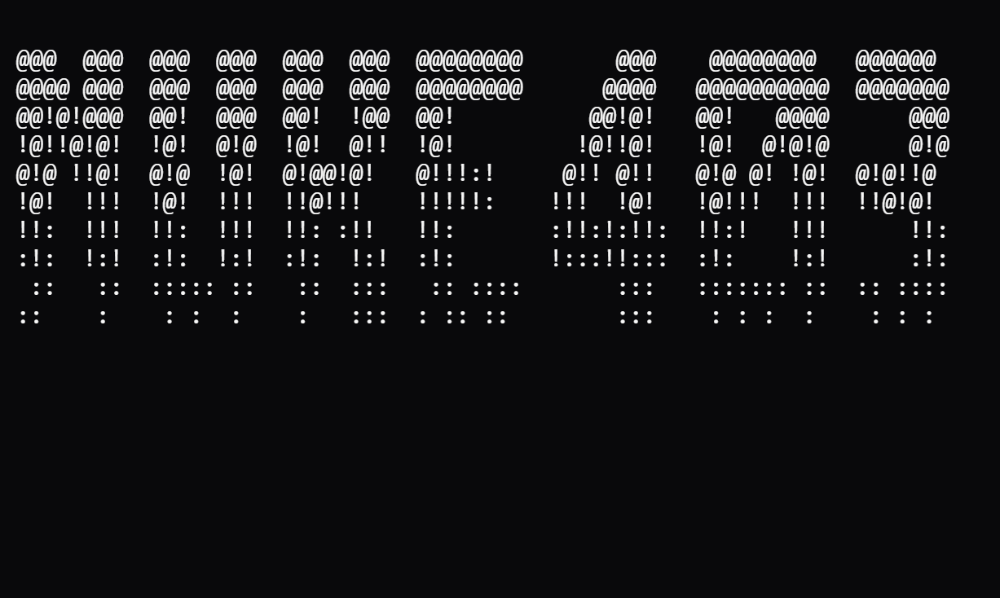

# Nuke403



**Nuke403** blends protocol trickery, header/path manipulation, and AI-guided exploration to identify and validate paths past access controls (403/401) with minimal false-positives. It’s built for professional red teams, consultancies, and bug-bounty workflows that demand rigor, speed, and explainability.

## Why Nuke403?

Existing “403 bypass” scripts are handy, but they’re noisy, brittle, and lack feedback loops. **Nuke403** is built for red-team and bug-bounty reality:

* **Minimal False Positives** — Triple validation (behavioral + TF-IDF similarity + shadow URL) before reporting.
* **Multi-Vector Evasion** — Path tricks, header forging, and protocol weirdness (HTTP/0.9, TE/CL, overrides).
* **AI-Guided** — BERT response classifier + DQN RL action selection; optional payload GAN for novelty.
* **Stealth Transport** — Async client with TLS fingerprint evasion, HTTP/2, smart retries, and proxy failover.
* **Signature-Aware** — Import & consolidate WAFW00F fingerprints for smarter profiling.
* **Operator-Ready** — Clean JSON/Markdown reports and PoC generators for reproducible evidence.

## Features at a Glance

* **Profiler & Fingerprinting**: Detect WAF/back-end/protocol traits; seed the right engines.
* **Path & Header Engines**: Trim/smuggle/matrix/dotless-IP; folding/poisoning/host inheritance.
* **Protocol Lab**: HTTP/0.9 backchannels, chunked-encoding edge cases, method overrides.
* **AI Core**: BERT (“blocked/bypass-possible/success/error”), RL next-action, optional payload GAN.
* **Triple Validation**: Behavior checks, TF-IDF similarity, and shadow-URL replays to kill FPs.
* **HTTPClient**: HTTP/1.1/2, TLS evasion, adaptive retries, rate-limit, caching, proxy rotation.
* **Reporting & PoCs**: JSON/Markdown summaries and Python/cURL/JS PoC templates for validated hits.

---
**Flow:** Profile target → Select engines → Generate payloads → Test → AI refines next steps → Triple-validate → Report.

---

## 🚀 Quick Start

### Requirements

* **Python** ≥ 3.8 (3.10+ recommended). Minimum supported: 3.7
* Linux/macOS/WSL2 recommended
* Python packages (install below)

### Install

```bash
git https://github.com/bl4ck0w1/nuke403.git
cd nuke403

python3 -m venv .venv && source .venv/bin/activate

pip install --upgrade pip
pip install -r requirements.txt

```

### Import WAF signatures from WAFW00F

```bash
python3 scripts/setup_wafwoof.py --output core/profiler/signatures/consolidated_waf_signatures.json
```

### Single Target

```bash
python3 nuke403.py -u https://target.example.com/admin -o out.json -F json -v
```

### Multiple Targets (file)

```bash
python3 nuke403.py -f targets.txt -o results.json -F json

```

### Stealth & Safety

```bash
python3 nuke403.py -u https://app.target.com --rate-limit 3 --timeout 20 --max-retries 1
```

### Proxies

```bash
python3 nuke403.py -u https://panel.target.com --proxy http://127.0.0.1:8080
```

## 🧰 CLI Reference

```
nuke403.py --help

            @@@  @@@  @@@  @@@  @@@  @@@  @@@@@@@@       @@@    @@@@@@@@   @@@@@@   
            @@@@ @@@  @@@  @@@  @@@  @@@  @@@@@@@@      @@@@   @@@@@@@@@@  @@@@@@@  
            @@!@!@@@  @@!  @@@  @@!  !@@  @@!          @@!@!   @@!   @@@@      @@@  
            !@!!@!@!  !@!  @!@  !@!  @!!  !@!         !@!!@!   !@!  @!@!@      @!@  
            @!@ !!@!  @!@  !@!  @!@@!@!   @!!!:!     @!! @!!   @!@ @! !@!  @!@!!@   
            !@!  !!!  !@!  !!!  !!@!!!    !!!!!:    !!!  !@!   !@!!!  !!!  !!@!@!   
            !!:  !!!  !!:  !!!  !!: :!!   !!:       :!!:!:!!:  !!:!   !!!      !!:  
            :!:  !:!  :!:  !:!  :!:  !:!  :!:       !:::!!:::  :!:    !:!      :!:  
            ::   ::  ::::: ::   ::  :::   :: ::::        :::   ::::::: ::  :: ::::  
            ::    :    : :  :    :   :::  : :: ::        :::    : : :  :    : : :     

                          Advanced 403/401 Bypass tool

Target Options:
  -u, --url URL               Target URL to test (required unless -f)
  -f, --file FILE             File containing multiple URLs

Output Options:
  -o, --output FILE           Output file for results
  -F, --format {json,markdown,text}   Output format (default: text)
      --no-color              Disable colored output

Scan Options:
  -t, --threads INT           Concurrent threads (default: 10)
      --timeout INT           Request timeout seconds (default: 30)
      --max-retries INT       Max retry attempts (default: 2)
      --rate-limit INT        Max requests per second (default: 5)

Attack Options:
      --no-path               Disable path-based attacks
      --no-header             Disable header-based attacks
      --no-protocol           Disable protocol-based attacks
      --no-ai                 Disable AI-guided attacks

Configuration Options:
  -c, --config FILE           YAML config file
      --user-agent STRING     Custom User-Agent
      --proxy URL             Proxy server (http://host:port)

General:
  -v, --verbose               Verbose output
  -q, --quiet                 Quiet (errors only)
      --version               Show version and exit
```

**1) Minimal run**

```bash
python3 nuke403.py -u https://shop.target.com/admin
```

**2) JSON report + verbose logs**

```bash
python3 nuke403.py -u https://portal.target.com/secure -o reports/portal.json -F json -v
```

**3) Disable protocol weirdness (path+header only)**

```bash
python3 nuke403.py -u https://api.target.com/v1/private --no-protocol
```

**4) Strict throttling**

```bash
python3 nuke403.py -u https://corp.target.com --rate-limit 2 --timeout 15 --max-retries 1
```

### 🧾 Reports & PoCs

* **JSON/Markdown** summaries: technique, payload, status, response sizes, basic evidence.
* **Exploit Generator**: emits PoC snippets (Python, cURL, JS) for validated findings.

  * These are **examples** for documentation. **Do not** run outside permitted scope.

**Nuke403** complements discovery tools (ffuf/dirsearch) and scanners (nuclei). It specializes in **multi-vector access bypass** with **AI feedback** and **strict FP controls**.

### 🔐 Legal & Safety Defaults

* Respects your **rate-limit** settings.
* No “autopwn” — it documents potential bypasses, then optionally generates PoC **examples**.

## FAQ — Questions You Should Ask

1. **Can this *really* bypass modern WAFs?**

   No tool can guarantee it. Nuke403 stacks multiple evasion classes (path/header/protocol) and **adapts** via RL while **classifying outcomes** with BERT. When bypasses happen, they’re usually target-specific parser mismatches or trust-chain quirks — and Nuke403’s **triple validation** helps you tell signal from noise.

2. **How is this different from ffuf/dirsearch/nuclei or “403-bypass” scripts?**

   Discovery tools excel at breadth via wordlists; “403-bypass” scripts try a handful of tricks. **Nuke403** focuses on **access control bypass** with **protocol-level** vectors, **AI-guided iteration**, and **strict validation** — it’s a complement, not a replacement.

3. **Do I need AI to get value?**

   No. You can disable AI with `--no-ai`. The engines still run. AI provides **prioritization**, **early “bypass-possible” signals**, and **novel payloads** — handy on tough targets or large scopes.

4. **How does Nuke403 keep false positives low?**
   Three ways:

   * **Behavioral** checks (codes, size sanity)
   * **Content** similarity (TF-IDF + fuzzy hashing) vs. baseline
   * **Shadow** URL cross-check — if a random non-existent path “works” the same way, it’s flagged

5. **Is it safe/legal to run?**

   It’s safe **within scope** you control. You **must** have written authorization. Use rate-limits, proxies, and program rules. The project is provided **as-is**, for research and permitted testing.

## 🛠 Troubleshooting

- If you encounter any issues, please [open an issue](https://github.com/bl4ck0w1/nuke403/issues) on GitHub.

## 🤝 Contributing

We welcome contributions! Please see our [Contributing Guidelines](CONTRIBUTING.md) for details.

1. Fork the repository
2. Create a feature branch (`git checkout -b feature/amazing-feature`)
3. Commit your changes (`git commit -m 'Add amazing feature'`)
4. Push to the branch (`git push origin feature/amazing-feature`)
5. Open a Pull Request

## 📄 License

This project is licensed under the APACHE 2.0 License - see the [LICENSE](LICENSE) file for details.

## 👤 Author

**Elie Uwimana**

* LinkedIn: [www.linkedin.com/in/elie-uwimana](http://www.linkedin.com/in/elie-uwimana)

**Remember**: With great power comes great responsibility. Use Nuke403 ethically, legally, and only on systems you have explicit permission to test.